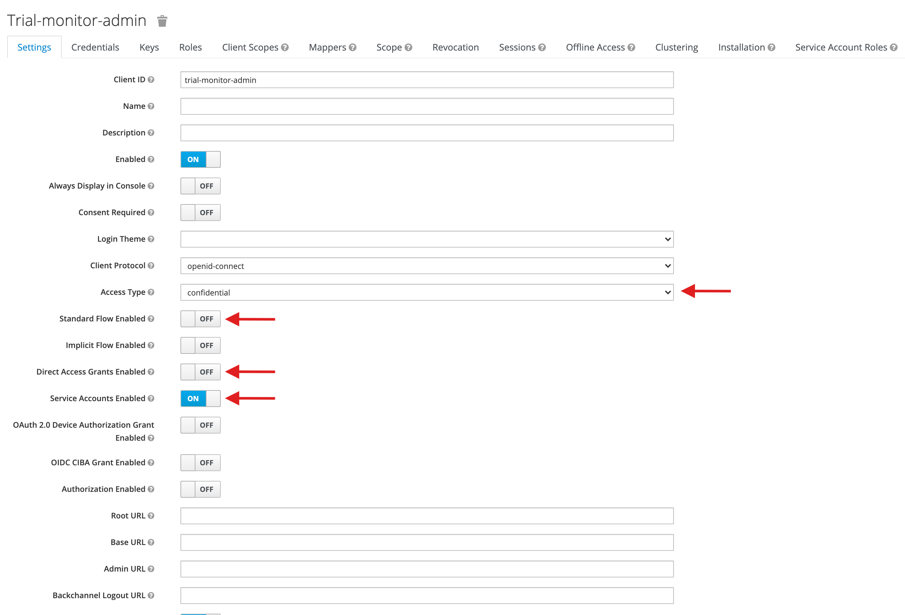
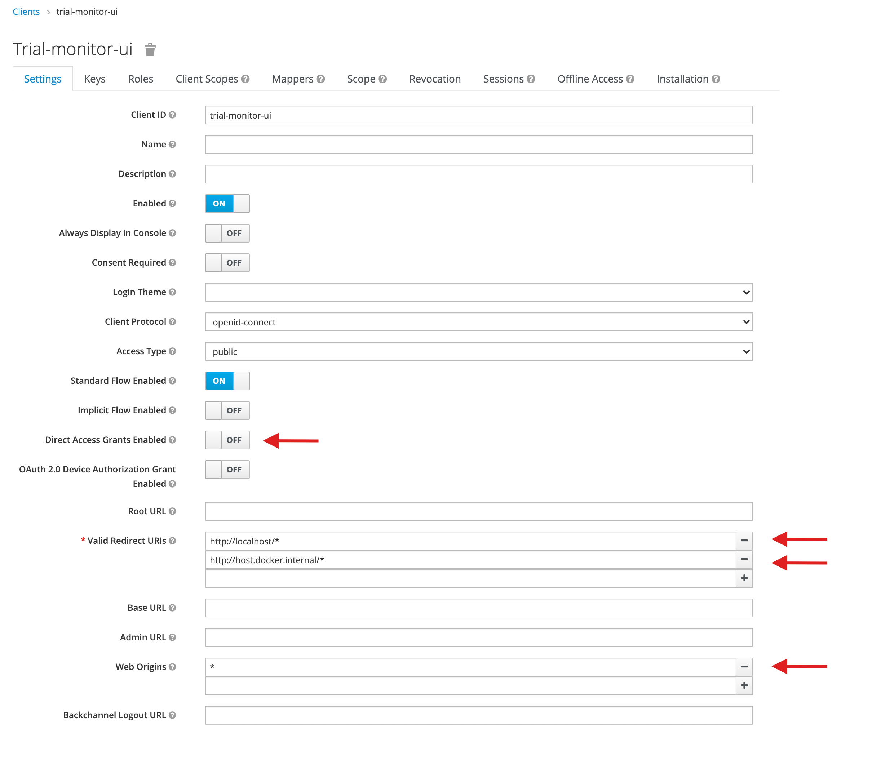

## No authentication

By default, Trial Monitor will be served from the root of the server and without authentication. To launch Trial Monitor in production without authentication, check out the code from this repository and run:

```
docker-compose up -d
```

In many cases, you'll want to control who has access to Trial Monitor. Trial Monitor helps you with this by providing support to authentication through [Keycloak](#keycloak) or [Firebase](#firebase).

:::note
If you're running Trial Monitor in a VM set the `API_URL` with `http://<ip>/api` and set the Host rule on the services' labels (e.g., `- "traefik.http.routers.frontend.rule=Host(`&lt;ip>`) && PathPrefix(`/`)"`).
:::

## Keycloak

[Keycloak](https://www.keycloak.org/) can be particularly useful in cases where you have to manage the authentication of users, roles and permissions.
After its configuration, you'll be able to limit users' access to the pages and components their role allows them access to.

#### Requirement: Docker configuration requirement

Note that Keycloak needs to be accessible using a hostname other than localhost, otherwise it will cause containers to not trust issued tokens or not be able to access Keycloak (since localhost is resolved in the container itself).
Normally, Docker Desktop for macOS and Windows automatically creates a hostname `host.docker.internal` which is used throughout this guide, however check it before moving on.
This can be achieved by adding the following line in `/etc/hosts`:

```text
127.0.0.1 host.docker.internal
```

#### 1. Update the ui-config file

Edit the `auth` property inside `config/ui-config.json` file with the following content:

```
"auth": {
  "provider": "keycloak",
  "config": {
    "url": "http://host.docker.internal/auth/",
    "realm": "trial-monitor",
    "clientId": "trial-monitor-ui"
  }
}
```

#### 2. Start the services

To get started, you can deploy Keycloak yourself or use the provided docker compose files.

```bash
# Production
docker-compose -f docker-compose.auth.yaml up -d

# Development
docker-compose -f docker-compose.devauth.yaml up -d
```

#### 3. Create an admin account

```bash
# Production
docker-compose -f docker-compose.auth.yaml exec -e KEYCLOAK_ADMIN=<Username> -e KEYCLOAK_ADMIN_PASSWORD=<Password> keycloak /opt/keycloak/bin/kc.sh start --auto-build
docker-compose -f docker-compose.auth.yaml restart keycloak

# Development
docker-compose -f docker-compose.devauth.yaml exec -e KEYCLOAK_ADMIN=<Username> -e KEYCLOAK_ADMIN_PASSWORD=<Password> keycloak /opt/keycloak/bin/kc.sh start-dev
docker-compose -f docker-compose.devauth.yaml restart keycloak
```

#### 4. Login to Admin Console

Go to the Keycloak Admin Console (`/auth/admin`) and login with the username and password you created earlier.

#### 5. Create Trial Monitor client

On Master realm, click on `Clients` and create a client with the Client ID `trial-monitor-admin`. Access type should be set to confidential, disable all flows to grant tokens and enable service accounts like in the following image:



Don't forget to save in the end.

#### 6. Assign admin role to trial-monitor-admin client

Inside `trial-monitor-admin` client, click on `Service Account Roles` tab. On `Available Roles` select `admin` and click on `Add selected >>` button.

#### 7. Update files in config folder

  a) Replace `auth.yaml` file in the `config/auth` directory with a `auth.json` file with the following content:

```json
{
  "provider": "keycloak",
  "baseUrl": "http://host.docker.internal/auth",
  "adminClientId": "trial-monitor-admin",
  "adminClientSecret": "<admin_client_secret>",
  "clientRealm": "trial-monitor",
  "clientId": "trial-monitor-api",
  "groups": {
    "admin": [
      "read-activity",
      "read-sensitive-info"
    ],
    "user": [
      "read-activity"
    ]
  }
}
```

:::info
If you're running Trial Monitor in a VM replace the `baseUrl` with `http://<your_vm_dns>/auth`.
:::

  b) Replace `adminClientSecret` value in `auth.json` with the Keycloak secret that can be retrieved in the `Credentials` tab of the `trial-monitor-admin` client.

  c) Add the desired groups and roles in `groups` property in the `auth.json` file. Edit the required permissions on pages and/or components (`config/blueprints/pages`) using the `requiredPermissions` attribute. Please check the [Custom permissions](/advanced/custom-permissions) page for details.

  d) Restart all services, the realm will be created and configured automatically by the application on startup:

```bash
# Production
docker-compose -f docker-compose.auth.yaml down && docker-compose -f docker-compose.auth.yaml up -d

# Development
docker-compose -f docker-compose.devauth.yaml down && docker-compose -f docker-compose.devauth.yaml up -d
```

#### 8. Create a client for the user interface

After the services are available again, open Keycloak Admin Console (`/auth/admin`). You'll be able to see a newly created realm (`Trial-monitor`), select it, go to `Clients` and create a new client with `trial-monitor-ui` Client ID. The access type should be public and configure the `Valid Redirect URIs` and `Web Origins` like in the following image:



```bash
# Valid Redirect URIs
http://localhost/*
http://host.docker.internal/*
```

:::caution
In case you are deploying Trial Monitor into a VM, make sure you add the DNS in the Valid Redirect URIs.
:::


Don't forget to save in the end.

#### 9. Update ui-config.json file (Only in Production mode)

:::info
If you're running Trial Monitor in development mode skip this part.
:::

In `trial-monitor-ui` client check the `Installation` tab, and select the `Keycloak OIDC JSON` format. Copy the generated configuration and merge the contents in the property `auth` of the file `config/ui-config.json`. The `auth` property should look similar to this:

```json
  "auth": {
    "provider": "keycloak",
    "config": {
      "realm": "trial-monitor",
      "clientId": "trial-monitor-ui",
      "url": "http://<domain_name>/auth/",
      "auth-server-url": "http://<domain_name>/auth",
      "ssl-required": "external",
      "resource": "trial-monitor-ui",
      "public-client": true,
      "confidential-port": 0
    }
  }
```

:::caution
Update `url` with the domain name from `auth-server-url`.
:::

#### 10. Create users and associate them to groups

You may now use the Keycloak Admin Console (`/auth/admin`) to create users. For this, select the realm that was automatically created (`Trial-monitor`), go to `Users` and create one. After its creation, use the `Groups` tab to associate with the groups they belong to (select one of the `Available Groups` and click on `Join` button). Permissions will be automatically assigned to the users based on the groups they belong to.

## Firebase

Firebase authentication can be a simple way to add authentication to Trial Monitor, especially in cases when you are already using Firebase as a database connector. Currently, Trial Monitor only supports Firebase authentication with the email and password provider.

To enable the authentication, on the Firebase console, add the provider Email/Password, and add your domain to the authorized domains. On the Service accounts section generate a new private account key.

On the `config/auth.yaml` set the provider to `firebase`, and the `serviceAccount` property with the service account information generated on the previous step:

````yaml
provider: firebase
serviceAccount:
   type: service_account
   project_id: project-id-00000
   private_key_id: KEY_ID
  ...
````

You'll also need to edit the `config/ui-config.json` to update the configuration used by the browser application. Set the provider to "firebase".

````json
{
  "auth": {
    "provider": "firebase",
    "config": {
      "apiKey": "API_KEY",
      "authDomain": "AUTH_DOMAIN",
      "projectId": "PROJECT_ID",
    }
  }
}
````

After this you'll be ready to launch Trial Monitor using Firebase authentication:

```bash
docker-compose up -d
```

New users can be created through the Firebase console.

:::danger
Be aware that you should not commit the service account configuration to a public repository.
:::

## Deployment to a subdirectory

By default Trial Monitor expects to be deployed on the domain root; however, it's possible to configure Trial Monitor to be deployed on a subdirectory as well. To achieve this, we need to make the following changes and rebuild the Docker images:

- On the Docker Compose file:
  - Set the `PUBLIC_URL` variables to the desired path (e.g. `/trial-monitor`);
  - On the `frontend` service, change the path of the volume that is mounted to include the new path (e.g., `- ./config/ui-config.json:/usr/share/nginx/html/**trial-monitor**/ui-config.json`) and change the PathPrefix in the labels (e.g., `PathPrefix(`/trial-monitor`)`);
  - On the `api` service, change the PathPrefix in the labels (e.g., `PathPrefix(`/trial-monitor/api`)`);
  - In case you are deploying with authentication, also set the `KC_HOSTNAME_PATH` and `KC_HTTP_RELATIVE_PATH` with the new path (e.g., /trial-monitor/auth) and change the PathPrefix in the labels (e.g., `PathPrefix(`/trial-monitor/auth`)`);
- On the `ui-config.json` file:
  - Change the `api_url` to include the new path (e.g. /trial-monitor/api);
- Finally, build the docker images and start the services: `docker-compose up --build`.

## HTTPS

To deploy Trial Monitor with HTTPS we have added configuration examples for certificates from [Let's Encrypt](https://letsencrypt.org/). To achieve this follow these instructions:

- On the Docker Compose file:
  - Remove `traefik.http.routers.api.entrypoints=web` from the `api` and `frontend` services;
  - Uncomment the following lines in the `api` and `frontend` services:
    - `traefik.http.routers.api.entrypoints=websecure`
    - `traefik.http.routers.api.tls.certresolver=myresolver`
  - Uncomment the following lines in the `traefik` service:
    - `--entrypoints.websecure.address=:443`
    - `--certificatesresolvers.myresolver.acme.httpchallenge=true`
    - `--certificatesresolvers.myresolver.acme.httpchallenge.entrypoint=web`
    - `--certificatesresolvers.myresolver.acme.email=<YOUR_EMAIL>` (don't forget to add your email here)
    - `--certificatesresolvers.myresolver.acme.storage=/letsencrypt/acme.json`
    - And in the volumes part: `- ./data/letsencrypt:/letsencrypt`
  - Make sure the Host is correctly defined in `api`, `frontend` and, if it's your case, the `keycloak` services.
