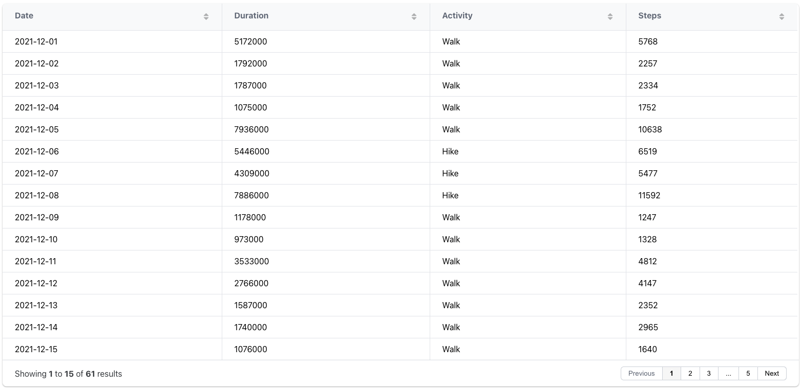
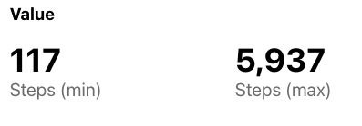
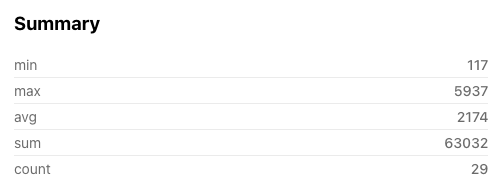

The main purpose of Data Components is to support the data analysis by representing data visually. Each component has `type` property that specifies which component should be used, properties common to all components, as well as other properties specific to the type of component.

All Data Component share the following properties:

- **type:** `chart` | `table` | `value` | `summary`
- **title:** a string that represents the component title
- **query:** describes which data to retrieve from the database
  - **database:** database identifier
  - **table:** string or an array of strings identifying the docs/tables/resources holding data
  - **fields:** (optional) defines which fields should be retrieved. If not provided, all fields will be retrieved.
  - **filters:** (optional) defines how data should be filtered. Please check the [`filters`](../Databases/overview#filters) section for details.
  - **groupby:** (optional) groups data based on one of the table fields. Requires fields to have aggregation operations.
- **reducer:** (optional) name of a custom function to transform the data before being used by the component.


```yaml
type: chart
title: Component title
query:
  database: database_id
  table: table_name
  fields: [type, value]
  filters:
    - target: value
      operator: '>='
      value: 2400
```

### Fields

The `fields` properties can be a simple string array with the name of the fields you want to retrieve from the database or an array of objects.
````yaml
# Array of strings
fields: [fieldNameA, fieldNameB]
````

````yaml
# Array of objects with custom field names
fields:
  - target: fieldNameA
    name: Field Name A
  - target: fieldNameB
    name: Field Name B
````

````yaml
# Array of objects with aggregation operations and custom field names
fields:
  - target: fieldName
    name: Field Name
    operator: [min, max, avg]
````

- **target:** string identifying a field from the database
- **name:** (optional) string with a user-friendly name to be shown on the dashboard
- **operator:** string or string array with the operation to perform. The following operations are available: `avg` | `max` | `min` | `sum` | `count`

### Alerts

The components `table`, and `value` can be configured to display warnings when one or more values are over a specific threshold. We can use this to quickly monitor specific parameters of the system (e.g. check if the average value is within the reference values).

To define a warning, add a property named `warnings` and inside set as key the corresponding fields for which you want to add a warning. For each field define the properties `threshold` and `operator`:

```yaml
  - type: table
    title: All data
    query:
      database: database_id
      table: table_name
      fields: [Duration, Date, ActivityType, Steps, Calories]
    warnings:
      Duration:
        threshold: 1222000
        operator: '>'
```

- **threshold**: (number) threshold value for triggering the warning in the interface
- **operator**: `>` | `<` | `=>` | `=>` | `==`

## Components
### Charts


The `chart` component enables the creation of a wide range of visualization for data analysis. Charts are built on top of [Vega-Lite](https://vega.github.io/vega-lite), which is a high-level grammar to create interactive graphics. It uses a declarative syntax that supports data and visual transformations (e.g. aggregation, binning, staking). Please check Vega-Lite website for more details and [examples](https://vega.github.io/vega-lite/examples/) of how to describe a chart.

The property `spec` accepts normal Vega-Lite specifications to describe charts. The data property that is available in normal Vega-Lite specifications is injected by Trial Monitor and does not need to be defined.

**Chart properties:**

- **spec:** Vega-Lite [specification](https://vega.github.io/vega-lite/docs/)

````yaml
  - type: chart
    title: Chart title
    query:
      [...]
    spec:
      mark: bar
      encoding:
        x:
          field: a
          type: nominal
        y:
          field: b
          type: quantitative

````

### Table



**Table properties:**

- **export:** `boolean` (optional) Default: false. Allow users to export an CSV with the table data.
- **pagination:** `boolean` | `integer` (optional) Allows users to disable the pagination or to change the number of rows per page. By default, pagination is enabled with 20 rows per page.
- **search:** `boolean` (optional) Default: true.

```yaml
- type: table
  title: Table title
  query:
    database: database_id
    table: table_name
    fields: [name, type, description, score]
  export: true
  pagination: 40
```

### Value

The `value` component provides a summative view of one or more measures. Values shown in the component are based on the [fields](#fields) property and required the definition of an `operator`.



**Value properties:**
- **precision:** `number` (optional) Default: 2. Controls the decimal places in the result

```yaml
- type: value
  title: Value title
  query:
    database: database_id
    table: table_name
    fields:
      - target: Steps
        operator: min
      - target: Steps
        operator: max
  precision: 0
```


### Summary

The `summary` component provides summary statistics from a specific field. The component will calculate the measures that are available for [fields](#fields).




**Value properties:**
- **precision:** `number` (optional) Default: 2. Controls the decimal places in the result

```yaml
- type: summary
  title: Summary title
  query:
    database: database_id
    table: table_name
    fields: Steps
  precision: 0
```